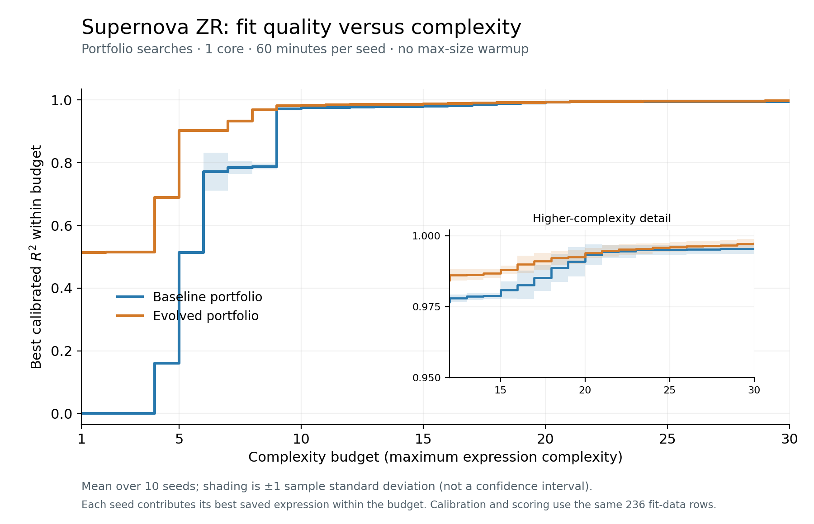

# Supernova ZR: calibrated R² versus complexity

The figure compares baseline and evolved 709715 portfolios from September 8: one core, 60 minutes per seed, 1-million-evaluation restarts, and no max-size warmup. Seeds are 10000–10009. For each integer complexity budget 1–30, each seed contributes the maximum calibrated R² among its saved frontier equations with complexity at or below that budget. Values are carried forward across gaps; there is no linear interpolation. Thus all ten seeds contribute at every budget. Curves show the mean, and bands show ±1 sample standard deviation (ddof=1), not SEM or confidence intervals. Band values are not clipped.

Calibration fits an external least-squares scale and offset, and R² is evaluated on the same 236 training observations. It is not raw predictive R², held-out performance, or Bazin-family recovery. These curves describe saved frontiers, not every candidate ever searched.

- [PDF](supernova_zr_calibrated_r2_vs_complexity.pdf)
- [Summary data](supernova_zr_calibrated_r2_vs_complexity_summary.csv)
- [Per-seed curves](supernova_zr_calibrated_r2_vs_complexity_per_seed.csv)
- [Reproduction script](../scripts/plot_supernova_calibrated_r2_complexity.py)
