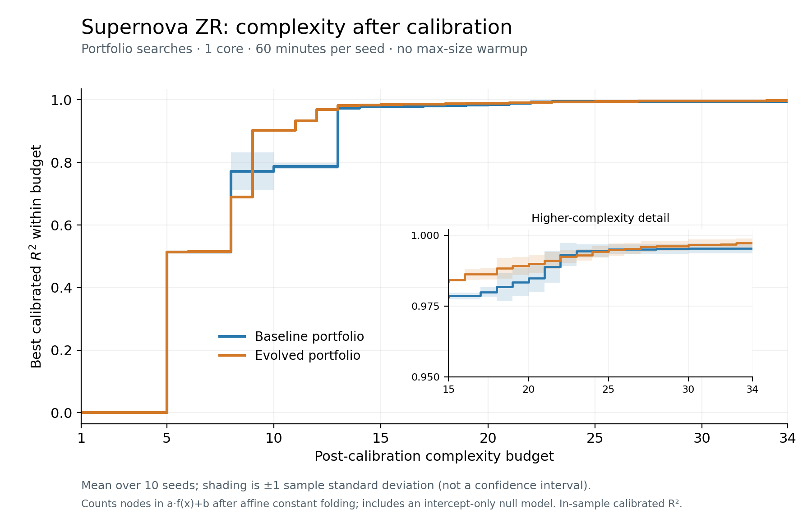

# Supernova ZR: post-calibration complexity

Same two portfolios and ten seeds as the original complexity plot. Each expression is transformed to its least-squares affine calibration a*f(x)+b. We then count its nodes, with each variable, constant, binary operation and unary function costing one. The original node counts were checked against all 390 saved expressions.

Counting uses constant folding, identities with exact zero/one, and affine rewrites through sums, products, and quotients to absorb scale/offset into existing constants. For example, a*(c*x+d)+b remains five nodes, while a*x+b costs five rather than one. No coefficient is dropped because it is small. This is a bounded simplification policy, not a claim of globally minimal algebraic complexity; transformations through log/exp/sqrt identities are not searched. The rewritten expressions' raw R² agrees with the original calibrated R² to within 1e-8 for every candidate.

Both methods also have an explicit target-mean constant predictor (complexity 1, R²=0), so all ten seeds contribute even below the smallest nonconstant calibrated expression. For budgets 1–34, take each seed's best score at or below the budget, then plot the mean ±1 sample standard deviation (ddof=1). Stepwise curves, no interpolation, no clipping of standard-deviation bands. Calibration and scoring use all 236 fit-data rows; there is no held-out evaluation.

- [PDF](supernova_zr_calibrated_r2_vs_post_calibration_complexity.pdf)
- [Summary](supernova_zr_calibrated_r2_vs_post_calibration_complexity_summary.csv)
- [Per-seed curves](supernova_zr_calibrated_r2_vs_post_calibration_complexity_per_seed.csv)
- [Every calibrated equation and node count](supernova_zr_calibrated_r2_vs_post_calibration_complexity_candidates.csv)
- Reproduce: `python scripts/plot_supernova_calibrated_r2_complexity.py --post-calibration`
