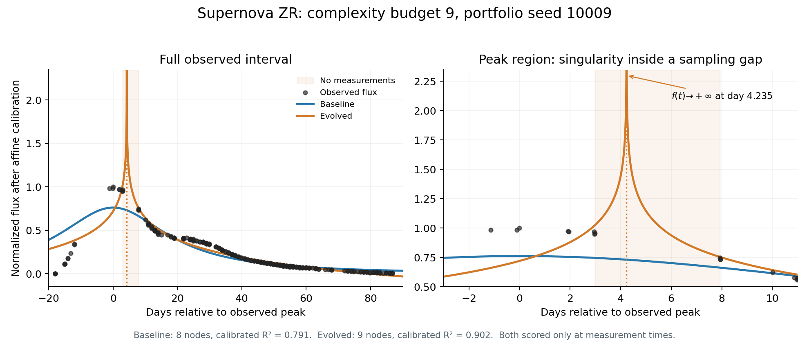

# Supernova ZR: the complexity-9 logarithmic fit

At post-calibration complexity budget 9, evolved has a higher measured-point R² but an interior singularity. It is not a credible approximation to the complete supernova light curve.

Representative portfolio seed 10009 (complexity includes affine calibration):

| Method | Nodes | Calibrated equation | R² |
| --- | ---: | --- | ---: |
| Baseline | 8 | 324.928392 / (t² + 424.217315) − 0.004609 | 0.790887 |
| Evolved | 9 | 1.080005 − 0.124944 ln((t − 4.234760)²) | 0.902123 |

These are the best saved equations with complexity **at most** 9, not necessarily exactly 9. All ten evolved seeds select essentially the same logarithmic expression at this budget. The baseline equation here is a representative seed, not the ten-seed mean.

The uncalibrated evolved expression is `log(square(4.234760003602217 - x0))`. The logarithm is a searched operator, not a transformation of the observed target. Squaring keeps its argument positive on either side of the center, but at the center the argument is zero. Multiplication by the negative calibration coefficient makes the prediction diverge to positive infinity as time approaches day 4.234760. The baseline reciprocal quadratic is finite throughout this interval.

The nearest measurements bracket the singularity at days 2.9818 and 7.91925. R² is evaluated only at the 236 measurement times, so it never penalizes the spike between them. Further, 186 of the 236 observations occur after day 20, giving the tail substantial weight. The logarithm supplies a compact peak-and-tail surrogate that scores well at sampled times despite its invalid interpolation. It eventually predicts negative flux as well, crossing zero near day 79.57.

This is an objective blind spot, not evidence of an arithmetic bug or intentional exploitation. Affine calibration reverses and rescales the original log curve; it does not remove its singularity. The higher R² therefore supports only a better pointwise numerical fit, not a more plausible supernova model. The reference family, A / (B exp(Ct) + exp(−Dt)), has a finite peak for positive A and B. Neither this logarithmic fit nor the baseline reciprocal quadratic recovers that family.

Physical interpretation should additionally check singularities and behavior between observations. Randomly holding out observations alone may preserve the same sampling gap. This finding concerns the complexity-9 expression and does not establish that all higher-complexity evolved fits have this pathology.

Reproduce with `python scripts/plot_supernova_complexity9.py`. Exact coefficients and selected candidate records are in `supernova_zr_complexity9_singularity.json`; the source candidates are in `supernova_zr_calibrated_r2_vs_post_calibration_complexity_candidates.csv`.
