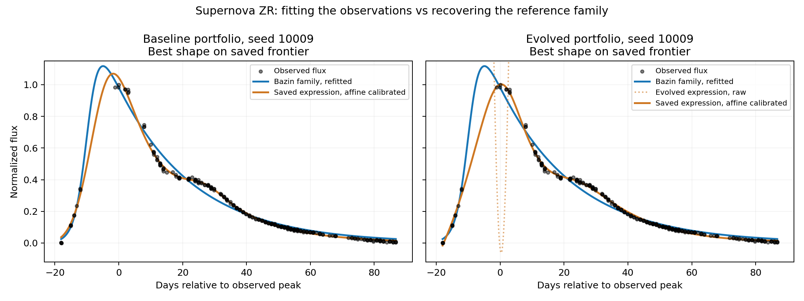

# Why evolved PySR misses the Supernova ZR reference

## Task and what the recovery score means

The local dataset has 236 observations of normalized supernova flux versus time,
from -18.04 to 86.75 days relative to the observed peak, with flux in [0, 1]. It
comes from example2 of the real supernova data in the
[MvSR publication repository](https://github.com/erusseil/MvSR-analysis/tree/main/real_data/supernovae).
The local source metadata is
[here](../pmlb/datasets/first_principles_supernovae_zr/metadata.yaml).

Our manual review accepts the family

```text
F(t) = A / (B*exp(C*t) + exp(-D*t)).
```

This is the empirical Bazin light-curve model. It is an accepted reference
family, not a known physical generating law for these observations. The
[source paper, section 5.3 and Table 4](https://arxiv.org/html/2402.04298v4#S5.SS3),
describes alternative formulas that fit better; it also discusses the difficulty
of modeling the secondary feature of r-band supernova light curves. Thus our E
score on this task should be read as **Bazin-family recovery**, not unique
physical ground-truth recovery. That qualifies the interpretation of the earlier
benchmark tables without changing which equations match the supplied reference.

## Saved-run evidence

All four setups below used one core, 60 minutes per seed, and no max-size warmup.
R² was recomputed on all 236 fit-data rows. Values are medians across ten seeds
of the best R² anywhere in each seed's saved frontier. The raw and calibrated
maxima may select different equations. These are not held-out scores or scores
restricted to the E-tagged candidates.

| Setup | Bazin E seeds | Best raw R² | Best affine-calibrated R² |
|---|---:|---:|---:|
| Baseline single | 7/10 | 0.9979 | 0.9979 |
| Baseline portfolio | 10/10 | 0.9952 | 0.9956 |
| Evolved single | 0/10 | 0.9971 | 0.9981 |
| Evolved portfolio | 0/10 | 0.9537 | 0.9979 |

A local fit of the four-parameter Bazin family, using 12 least-squares starts,
reached R² = 0.97762. Optimizing its shape with an additional external affine
calibration reached R² = 0.97912. These numerical fits are not a proof of global
optimality. Every saved frontier in this comparison contains a candidate with
better calibrated in-sample R² than that fitted reference.



The plotted candidates are the best shape fits from seed 10009, not necessarily
the model selected for deployment or the candidate cited by the recovery judge.
The raw evolved curve extends beyond the displayed flux range. The observations
have a shoulder around 20–30 days that the fitted Bazin curve misses.

## What the evolved algorithm does

The [evolved loss](../runs/709715/operators/gen34_loss7.jl) fits the best slope and
offset between each expression's predictions and the observed target. Its main
term is the normalized residual after this calibration; a bounded raw-fit
penalty has a maximum weight of only 1/256. Up to the small target-norm floor,
the main term is sqrt(1 - R² after affine calibration).

Consequences visible in the saved runs:

- A raw equation can be badly scaled or offset while receiving a good search
  loss. This is especially visible in the portfolio raw/calibrated R² gap.
- The frontiers contain rational/polynomial/logarithmic surrogates and nonlinear
  exponential arguments, often reaching 28–30 nodes. They fit the observed
  shape well but do not reduce to two linear-in-time exponentials in the
  denominator.
- Evolved portfolio seed 10009 has the reviewed near candidate
  `(cube(t*0.05714771159132355)+0.9762721573677837) /
  (exp(t*0.11970389490966137)*(exp(t*-0.24670687672814717)+1.2756369326234833))`.
  Its denominator is the sum of two exponentials, but the numerator has a
  nonconstant cubic term. That is a real structural mismatch under our reference
  criterion, even if it improves an empirical fit.
- The evolved portfolio completed 77–81 successful restarts per seed versus
  211–219 for baseline, approximately 2.7 times fewer independent searches in
  the same hour. This can reduce chances of reaching the simple reference
  family. The present inspection does not isolate which operator or overhead
  causes the difference in throughput.

The evolved mutation also favors cloning existing subexpressions and combining
them as sums, products, or `u/(1-v)`. Its feature-remapping branch has no effect
on this one-input task. That is a plausible search-bias contribution, but these
logs cannot establish it as the cause; baseline/evolved also differ in loss,
selection, survival, and runtime per restart.

## Interpretation and useful follow-up

The evidence supports a mismatch between the **specific-family recovery metric**
and the **empirical fitting objective**, plus a real raw-calibration and throughput
disadvantage for evolved portfolio. It does not show that evolved cannot model
the observed light curve. Nor does high training R² establish better scientific
extrapolation: the evolved models are substantially more flexible than the
four-parameter reference.

For reporting, retain Bazin-family recovery as an explicit metric alongside
fit quality and complexity. To identify causality, the most informative next
controlled comparison would use the evolved search operators with baseline L1
loss and the baseline search operators with the evolved loss, with search effort
reported both in wall time and successful restarts. No such jobs were submitted.

## Reproduction

- [Diagnostic script](../scripts/analyze_supernova_zr_2026_09_08.py)
- [Per-seed numeric results and selected equations](supernova_zr_diagnostic_2026-09-08.json)
- [Previous recovery audit](benchmark_results_2026-09-08.md)

The diagnostic reads saved frontiers and locally refits only the reference
model's parameters. It performs no SR search, external API calls, or Slurm
submission. Evaluation follows the printed expression tree rather than
symbolically simplifying it, preserving floating-point cancellation behavior.
