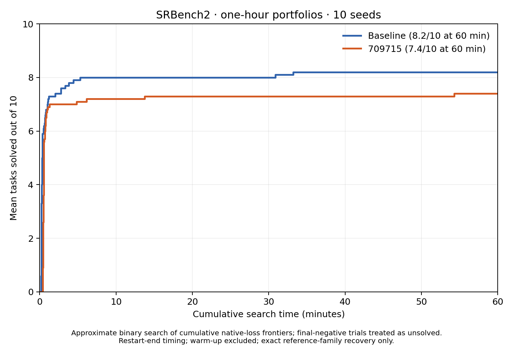

# SRBench2 approximate portfolio recovery over time

Binary search assumes cumulative-frontier recovery persists. Final-negative trials are treated as never solved; temporary recoveries may be missed. This is not exhaustive ever-recovered scoring.

Native training loss selects each cumulative complexity–loss frontier. Audited final labels initialize the search; midpoint reviews use the same exact-family rubric with explicit fixed-coefficient constraints. No raw-R² gate or calibration-based score is used. Absorption and Bode are excluded.

Timing uses cumulative recorded search seconds at restart completion, excluding warm-up/scoring. Final overshoot is mapped to 3600 seconds.

New LLM usage-based cost at stored batch rates: $1.8679. Model: openai/gpt-5.6-terra, medium reasoning. All 200 final frontiers were reconstructed and matched against the saved aggregate before reusing labels.

614 new API reviews across 8 rounds. Bounded algebra checks of selected exact equations are recorded in positive_check.json. One Newton false positive was corrected after checking its full 16-candidate frontier; corrected search bounds were rebuilt from cached decisions. See review_overrides.json and validation.json.

| Task | Baseline exact / 10 | 709715 exact / 10 |
|---|---:|---:|
| first_principles_hubble | 10 | 10 |
| first_principles_ideal_gas | 10 | 10 |
| first_principles_kepler | 10 | 10 |
| first_principles_leavitt | 10 | 10 |
| first_principles_newton | 10 | 10 |
| first_principles_planck | 0 | 0 |
| first_principles_rydberg | 2 | 4 |
| first_principles_schechter | 10 | 10 |
| first_principles_supernovae_zr | 10 | 0 |
| first_principles_tully_fisher | 10 | 10 |

[Log-scale plot](../../figures/srbench2_portfolio_solve_over_time/solve_rate_log.png). Trial timings are in per_trial.csv and first_recovery.json.

Re-render without API calls: `python scripts/srbench2_portfolio_recovery.py --render-only`. Resume unfinished rounds with `--run`. Requests, responses, frontier snapshots, decisions, and source fingerprints are retained in this directory.
