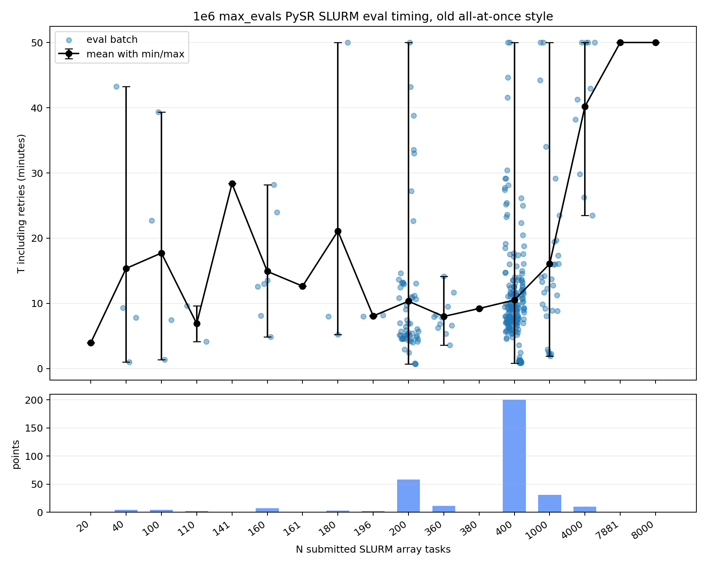

# PySR SLURM parallel-eval timing — old all-at-once style, 1e6 max_evals

Source script: `scripts/analyze_pysr_slurm_timing.py` (run with no args).

## Methodology

- Iterated all `out/<slurm_id>.out` files (parent driver logs).
- Inferred the driver from the embedded command line or from log markers; kept only
  `evolve_pysr.py` and `evaluate_new_pysr.py` runs (HPO/openevolve excluded).
- For `evolve_pysr.py` runs, dropped the *new* implementation (one SLURM batch per
  freshly created operator). The new style is detected by `Submitted SLURM job array
  ... batch eval_...`, `Waiting on N ... batches`, or `submit_bundle_future` markers
  in the log.
- For each `PySR SLURM eval: N tasks in batch eval_NNNN ...` block, opened the
  associated `tasks.json` to confirm every task uses `pysr_kwargs.max_evals == 1_000_000`.
  Blocks where any task differs were dropped.
- **N is the uncached count** — the number of tasks actually submitted to SLURM,
  parsed from `Submitted SLURM job array: <jid> (<n> tasks)` (which is `len(chunk)`
  over `uncached_indices`). For arrays larger than `MaxArraySize`, multiple
  submissions are summed; the `array_job_ids` column lists every parent array id.
  Of 338 data points, 30 had partial caching where N < total batch (e.g. one batch
  had total=400 but only N=200 went to SLURM after cache hits).
- Fully-cached blocks (`All N tasks served from cache - skipping SLURM`) are dropped.
- `T_s` = `initial_seconds + retry_seconds`:
  - `initial_seconds`: from `All N tasks completed in T s` or
    `All N initial tasks completed in T s` (the wait timer starts on SLURM submission,
    after caching, so T already excludes cache lookup time). If neither is present
    (timeout/stall), falls back to `TIMEOUT: ... exceeded T s`, then to the last
    `Progress: ... Ts elapsed` as a lower bound.
  - `retry_seconds`: sum of `Retry completed in T s` (and last seen
    `Retry progress: ... T s elapsed` for active retries that did not finish cleanly).
- `T_s = 3000.0` corresponds to the 3000s parent-driver job timeout — values pinned
  exactly at 3000.0 are right-censored (the SLURM eval was cancelled, not finished).

## Plot

Plot file: `scripts/claude_pysr_slurm_search.png`
(identical copy at `plots/pysr_slurm_parallel_eval_1e6_oldstyle_timing.png`)

CSV outputs from the helper script:
- `plots/pysr_slurm_parallel_eval_1e6_oldstyle_points.csv` — every (parent, batch) data point
- `plots/pysr_slurm_parallel_eval_1e6_oldstyle_stats.csv` — per-N summary
- `plots/pysr_slurm_parallel_eval_1e6_oldstyle_jobs.csv` — parent job → command

## Counts
- 31 parent SLURM jobs
- 338 (N, T) data points
- 30 points had partial caching (N < total batch)

Relevant parent SLURM jobs
| slurm_id | source | command |
|---:|---|---|
| 157619 | evaluate_new_pysr.py | `evaluate_new_pysr.py --evolve-results runs/947961/run_data.json --splits splits/train.txt splits/val.txt splits/barely_unsolvable.txt --seed 1000 --n-runs 10 --max-evals 1000000 --timeout 600 --pysr-wall-limit 900 --time-limit 02:00:00` |
| 157620 | evaluate_new_pysr.py | `evaluate_new_pysr.py --splits splits/train.txt splits/val.txt splits/barely_unsolvable.txt --seed 1000 --n-runs 10 --max-evals 1000000 --timeout 600 --pysr-wall-limit 900 --time-limit 02:00:00` |
| 157720 | evaluate_new_pysr.py | `evaluate_new_pysr.py --evolve-results runs/947961/run_data.json --splits splits/train.txt splits/val.txt splits/barely_unsolvable.txt --seed 1000 --n-runs 10 --max-evals 1000000 --noise 0.001 --timeout 600 --pysr-wall-limit 900 --time-limit 02:00:00` |
| 157721 | evaluate_new_pysr.py | `evaluate_new_pysr.py --splits splits/train.txt splits/val.txt splits/barely_unsolvable.txt --seed 1000 --n-runs 10 --max-evals 1000000 --noise 0.001 --timeout 600 --pysr-wall-limit 900 --time-limit 02:00:00` |
| 234143 | evaluate_new_pysr.py | `(not logged; inferred from run output)` |
| 234144 | evaluate_new_pysr.py | `(not logged; inferred from run output)` |
| 234145 | evaluate_new_pysr.py | `(not logged; inferred from run output)` |
| 234147 | evaluate_new_pysr.py | `(not logged; inferred from run output)` |
| 253071 | evaluate_new_pysr.py | `evaluate_new_pysr.py --evolve-results runs/947961/run_data.json --splits splits/barely_unsolvable_val2.txt --seed 1000 --n-runs 10 --max-evals 1000000 --timeout 600 --pysr-wall-limit 900 --time-limit 02:00:00` |
| 253072 | evaluate_new_pysr.py | `evaluate_new_pysr.py --splits splits/barely_unsolvable_val2.txt --seed 1000 --n-runs 10 --max-evals 1000000 --timeout 600 --pysr-wall-limit 900 --time-limit 02:00:00` |
| 354754 | evolve_pysr.py | `evolve_pysr.py --operator_type all --generations 2 --population 40 --offspring 40 --n-runs 10 --max_evals 1000000 --split splits/barely_unsolvable.txt` |
| 354755 | evolve_pysr.py | `evolve_pysr.py --operator_type all --generations 10 --population 10 --offspring 10 --n-runs 1 --max_evals 1000000 --split splits/barely_unsolvable.txt` |
| 355508 | evolve_pysr.py | `evolve_pysr.py --operator_type all --generations 10 --population 10 --offspring 10 --n-runs 1 --max_evals 1000000 --split splits/barely_unsolvable.txt --racing` |
| 355589 | evolve_pysr.py | `evolve_pysr.py --operator_type all --generations 10 --population 10 --offspring 10 --n-runs 1 --max_evals 1000000 --split splits/barely_unsolvable.txt --task_diverse_pop --task_aware` |
| 395522 | evolve_pysr.py | `evolve_pysr.py --operator_type all --generations 2 --population 40 --offspring 40 --n-runs 10 --max_evals 1000000 --split splits/barely_unsolvable.txt` |
| 468274 | evolve_pysr.py | `evolve_pysr.py --operator_type all --generations 30 --population 5 --offspring 5 --n-runs 1 --max_evals 1000000 --split splits/barely_unsolvable.txt --racing` |
| 468276 | evolve_pysr.py | `evolve_pysr.py --operator_type all --generations 1 --population 40 --offspring 40 --n-runs 10 --max_evals 1000000 --split splits/barely_unsolvable.txt` |
| 499254 | evolve_pysr.py | `evolve_pysr.py --operator_type all --generations 10 --population 5 --offspring 20 --n-runs 10 --max_evals 1000000 --split splits/barely_unsolvable.txt` |
| 499255 | evolve_pysr.py | `evolve_pysr.py --operator_type all --generations 60 --population 5 --offspring 5 --n-runs 2 --max_evals 1000000 --split splits/barely_unsolvable.txt --racing` |
| 499256 | evolve_pysr.py | `evolve_pysr.py --operator_type all --generations 10 --population 10 --offspring 10 --n-runs 5 --max_evals 1000000 --split splits/barely_unsolvable.txt --task_diverse_pop --task_aware` |
| 572209 | evaluate_new_pysr.py | `evaluate_new_pysr.py --evolve-results outputs/eval_best_so_far_499254_gen9/run_data_snapshot.json --splits splits/train.txt splits/val.txt splits/barely_unsolvable.txt --n-runs 10 --seed 32 --partition ellis --output-dir outputs/eval_best_so_far_499254_gen9` |
| 572260 | evaluate_new_pysr.py | `evaluate_new_pysr.py --evolve-results outputs/eval_best_so_far_499255_gen16/run_data_snapshot.json --splits splits/train.txt splits/val.txt splits/barely_unsolvable.txt --n-runs 10 --seed 32 --partition ellis --output-dir outputs/eval_best_so_far_499255_gen16` |
| 595409 | evolve_pysr.py | `evolve_pysr.py --operator_type all --generations 60 --population 5 --offspring 5 --n-runs 2 --max_evals 1000000 --split splits/barely_unsolvable.txt --racing --hof` |
| 608003 | evolve_pysr.py | `evolve_pysr.py --operator_type all --generations 60 --population 5 --offspring 5 --n-runs 2 --max_evals 1000000 --split splits/barely_unsolvable.txt --racing --continue_from runs/499255` |
| 669093 | evolve_pysr.py | `evolve_pysr.py --operator_type all --generations 30 --population 5 --offspring 5 --n-runs 2 --max_evals 1000000 --split splits/barely_unsolvable.txt --racing --exec_feedback_n 3` |
| 669094 | evolve_pysr.py | `evolve_pysr.py --operator_type all --generations 5 --population 10 --offspring 10 --n-runs 5 --max_evals 1000000 --split splits/barely_unsolvable.txt --task_diverse_pop --exec_feedback_n 3` |
| 691785 | evolve_pysr.py | `evolve_pysr.py --operator_type all --generations 30 --population 5 --offspring 5 --n-runs 2 --max_evals 1000000 --split splits/barely_unsolvable.txt --racing --exec_feedback_n 3` |
| 691786 | evolve_pysr.py | `evolve_pysr.py --operator_type all --generations 5 --population 10 --offspring 10 --n-runs 5 --max_evals 1000000 --split splits/barely_unsolvable.txt --task_diverse_pop --exec_feedback_n 3` |
| 695307 | evolve_pysr.py | `evolve_pysr.py --operator_type all --generations 30 --population 5 --offspring 5 --n-runs 2 --max_evals 1000000 --split splits/barely_unsolvable.txt --racing --exec_feedback_n 3` |
| 695308 | evolve_pysr.py | `evolve_pysr.py --operator_type all --generations 5 --population 10 --offspring 10 --n-runs 5 --max_evals 1000000 --split splits/barely_unsolvable.txt --task_diverse_pop --exec_feedback_n 3` |
| 726782 | evolve_pysr.py | `evolve_pysr.py --operator_type all --generations 5 --population 10 --offspring 10 --n-runs 5 --max_evals 1000000 --split splits/barely_unsolvable.txt --task_diverse_pop --exec_feedback_n 3` |

Per-N summary (N = uncached tasks actually submitted to SLURM)
| N | points | mean_s | median_s | var_s2 | min_s | max_s |
|---:|---:|---:|---:|---:|---:|---:|
| 20 | 1 | 238.5 | 238.5 | 0.0 | 238.5 | 238.5 |
| 40 | 4 | 921.7 | 513.9 | 970216.0 | 62.3 | 2596.7 |
| 100 | 4 | 1063.3 | 905.2 | 776686.9 | 83.2 | 2359.7 |
| 110 | 2 | 413.9 | 413.9 | 27291.0 | 248.7 | 579.1 |
| 141 | 1 | 1701.2 | 1701.2 | 0.0 | 1701.2 | 1701.2 |
| 160 | 7 | 894.4 | 779.7 | 213913.8 | 294.1 | 1692.5 |
| 161 | 1 | 758.7 | 758.7 | 0.0 | 758.7 | 758.7 |
| 180 | 3 | 1265.4 | 481.0 | 1508936.8 | 315.3 | 3000.0 |
| 196 | 2 | 484.2 | 484.2 | 29.2 | 478.8 | 489.6 |
| 200 | 58 | 619.9 | 348.2 | 387185.9 | 41.3 | 3000.0 |
| 360 | 11 | 480.0 | 471.1 | 28158.4 | 216.7 | 848.6 |
| 380 | 1 | 553.0 | 553.0 | 0.0 | 553.0 | 553.0 |
| 400 | 200 | 630.8 | 543.6 | 227310.7 | 51.6 | 3000.0 |
| 1000 | 31 | 963.6 | 797.3 | 596965.2 | 113.8 | 3000.0 |
| 4000 | 10 | 2412.0 | 2528.2 | 352465.7 | 1409.9 | 3000.0 |
| 7881 | 1 | 3000.0 | 3000.0 | 0.0 | 3000.0 | 3000.0 |
| 8000 | 1 | 3000.0 | 3000.0 | 0.0 | 3000.0 | 3000.0 |

Data points
| parent_slurm_id | line | batch | array_job_ids | N | total | cached | T_s | source |
|---:|---:|---|---|---:|---:|---:|---:|---|
| 157619 | 20 | eval_0000 | 157828 | 200 | 200 | 0 | 818.6 | evaluate_new_pysr.py |
| 157619 | 75 | eval_0001 | 160572 | 200 | 200 | 0 | 649.8 | evaluate_new_pysr.py |
| 157619 | 131 | eval_0002 | 161079 | 160 | 200 | 40 | 753.9 | evaluate_new_pysr.py |
| 157620 | 16 | eval_0000 | 157723 | 200 | 200 | 0 | 311.7 | evaluate_new_pysr.py |
| 157620 | 47 | eval_0001 | 158709 | 200 | 200 | 0 | 419.3 | evaluate_new_pysr.py |
| 157620 | 77 | eval_0002 | 160376 | 160 | 200 | 40 | 487.8 | evaluate_new_pysr.py |
| 157720 | 20 | eval_0000 | 209156 | 200 | 200 | 0 | 746.3 | evaluate_new_pysr.py |
| 157720 | 72 | eval_0001 | 210450 | 200 | 200 | 0 | 877.0 | evaluate_new_pysr.py |
| 157720 | 132 | eval_0002 | 212494 | 161 | 200 | 39 | 758.7 | evaluate_new_pysr.py |
| 157721 | 16 | eval_0000 | 209053 | 200 | 200 | 0 | 302.5 | evaluate_new_pysr.py |
| 157721 | 42 | eval_0001 | 209484 | 200 | 200 | 0 | 343.2 | evaluate_new_pysr.py |
| 157721 | 71 | eval_0002 | 209960 | 160 | 200 | 40 | 779.7 | evaluate_new_pysr.py |
| 234143 | 13 | eval_0000 | 234259 | 200 | 200 | 0 | 272.7 | evaluate_new_pysr.py |
| 234143 | 37 | eval_0001 | 235051 | 200 | 200 | 0 | 786.6 | evaluate_new_pysr.py |
| 234144 | 13 | eval_0000 | 234258 | 200 | 200 | 0 | 273.6 | evaluate_new_pysr.py |
| 234144 | 37 | eval_0001 | 235053 | 200 | 200 | 0 | 795.3 | evaluate_new_pysr.py |
| 234145 | 16 | eval_0000 | 234257 | 200 | 200 | 0 | 273.4 | evaluate_new_pysr.py |
| 234145 | 40 | eval_0001 | 235052 | 200 | 200 | 0 | 787.9 | evaluate_new_pysr.py |
| 234147 | 16 | eval_0000 | 234256 | 200 | 200 | 0 | 280.8 | evaluate_new_pysr.py |
| 234147 | 40 | eval_0001 | 235068 | 200 | 200 | 0 | 778.3 | evaluate_new_pysr.py |
| 253071 | 26 | eval_0000 | 253201 | 110 | 200 | 90 | 579.1 | evaluate_new_pysr.py |
| 253072 | 16 | eval_0000 | 253073 | 110 | 200 | 90 | 248.7 | evaluate_new_pysr.py |
| 354754 | 19 | eval_0000 | 354757 | 200 | 200 | 0 | 301.1 | evolve_pysr.py |
| 354754 | 851 | eval_0000 | 380718 | 200 | 200 | 0 | 175.8 | evolve_pysr.py |
| 354755 | 19 | eval_0000 | 354756 | 20 | 20 | 0 | 238.5 | evolve_pysr.py |
| 355508 | 1065 | eval_0000 | 381976 | 200 | 200 | 0 | 274.0 | evolve_pysr.py |
| 355508 | 149 | eval_0001 | 357556 | 180 | 200 | 20 | 481.0 | evolve_pysr.py |
| 355508 | 224 | eval_0002 | 360593 | 360 | 400 | 40 | 476.8 | evolve_pysr.py |
| 355508 | 323 | eval_0003 | 363018 | 360 | 400 | 40 | 496.5 | evolve_pysr.py |
| 355508 | 401 | eval_0004 | 365826 | 360 | 400 | 40 | 375.0 | evolve_pysr.py |
| 355508 | 493 | eval_0005 | 368064 | 360 | 400 | 40 | 410.0 | evolve_pysr.py |
| 355508 | 575 | eval_0006 | 369862 | 360 | 400 | 40 | 471.1 | evolve_pysr.py |
| 355508 | 654 | eval_0007 | 371834 | 360 | 400 | 40 | 848.6 | evolve_pysr.py |
| 355508 | 755 | eval_0008 | 374997 | 360 | 400 | 40 | 321.0 | evolve_pysr.py |
| 355508 | 831 | eval_0009 | 376722 | 360 | 400 | 40 | 569.0 | evolve_pysr.py |
| 355508 | 915 | eval_0010 | 378813 | 360 | 400 | 40 | 216.7 | evolve_pysr.py |
| 355508 | 997 | eval_0011 | 381371 | 360 | 400 | 40 | 396.0 | evolve_pysr.py |
| 355589 | 987 | eval_0000 | 380289 | 200 | 200 | 0 | 148.8 | evolve_pysr.py |
| 355589 | 144 | eval_0001 | 356793 | 200 | 200 | 0 | 307.0 | evolve_pysr.py |
| 355589 | 215 | eval_0002 | 358512 | 200 | 200 | 0 | 546.6 | evolve_pysr.py |
| 355589 | 309 | eval_0003 | 361284 | 200 | 200 | 0 | 386.3 | evolve_pysr.py |
| 355589 | 382 | eval_0004 | 364196 | 200 | 200 | 0 | 352.5 | evolve_pysr.py |
| 355589 | 459 | eval_0005 | 366256 | 200 | 200 | 0 | 582.6 | evolve_pysr.py |
| 355589 | 544 | eval_0006 | 368477 | 200 | 200 | 0 | 447.5 | evolve_pysr.py |
| 355589 | 619 | eval_0007 | 370733 | 200 | 200 | 0 | 310.0 | evolve_pysr.py |
| 355589 | 700 | eval_0008 | 373344 | 200 | 200 | 0 | 317.4 | evolve_pysr.py |
| 355589 | 779 | eval_0009 | 374596 | 200 | 200 | 0 | 416.3 | evolve_pysr.py |
| 355589 | 856 | eval_0010 | 377677 | 200 | 200 | 0 | 259.0 | evolve_pysr.py |
| 355589 | 930 | eval_0011 | 379601 | 200 | 200 | 0 | 331.1 | evolve_pysr.py |
| 395522 | 18 | eval_0000 | 395526 | 200 | 200 | 0 | 306.8 | evolve_pysr.py |
| 468274 | 58 | eval_0001 | 468283 | 100 | 100 | 0 | 1361.0 | evolve_pysr.py |
| 468274 | 142 | eval_0002 | 468701 | 200 | 200 | 0 | 3000.0 | evolve_pysr.py |
| 468274 | 220 | eval_0003 | 474999 | 141 | 200 | 59 | 1701.2 | evolve_pysr.py |
| 468274 | 292 | eval_0004 | 479236 | 160 | 200 | 40 | 814.7 | evolve_pysr.py |
| 468274 | 384 | eval_0005 | 481226 | 160 | 200 | 40 | 294.1 | evolve_pysr.py |
| 468274 | 448 | eval_0006 | 482143 | 200 | 200 | 0 | 413.7 | evolve_pysr.py |
| 468276 | 1044 | eval_0000 | 491709 | 180 | 200 | 20 | 315.3 | evolve_pysr.py |
| 468276 | 273 | eval_0001 | 469224;469225;469226;469227;469228;469229;469230;469263 | 7881 | 8000 | 119 | 3000.0 | evolve_pysr.py |
| 468276 | 1072 | eval_0001 | 492090 | 180 | 200 | 20 | 3000.0 | evolve_pysr.py |
| 468276 | 760 | eval_0002 | 483561;483562;483564;483565;483566;483567;483568;483569 | 8000 | 8000 | 0 | 3000.0 | evolve_pysr.py |
| 499254 | 19 | eval_0000 | 499260 | 200 | 200 | 0 | 2590.1 | evolve_pysr.py |
| 499254 | 2682 | eval_0000 | 577341 | 200 | 200 | 0 | 273.2 | evolve_pysr.py |
| 499254 | 120 | eval_0001 | 500842 | 1000 | 1000 | 0 | 2654.2 | evolve_pysr.py |
| 499254 | 2708 | eval_0001 | 577646 | 200 | 200 | 0 | 251.6 | evolve_pysr.py |
| 499254 | 278 | eval_0002 | 506964;506965;506966;506967 | 4000 | 4000 | 0 | 2291.2 | evolve_pysr.py |
| 499254 | 513 | eval_0003 | 513975;513976;513977;513978 | 4000 | 4000 | 0 | 2477.9 | evolve_pysr.py |
| 499254 | 764 | eval_0004 | 522704;522705;522706;522707 | 4000 | 4000 | 0 | 1788.4 | evolve_pysr.py |
| 499254 | 997 | eval_0005 | 532482;532483;532484;532485 | 4000 | 4000 | 0 | 3000.0 | evolve_pysr.py |
| 499254 | 1232 | eval_0006 | 539734;539735;539736;539737 | 4000 | 4000 | 0 | 1574.2 | evolve_pysr.py |
| 499254 | 1465 | eval_0007 | 545567;545568;545569;545570 | 4000 | 4000 | 0 | 3000.0 | evolve_pysr.py |
| 499254 | 1722 | eval_0008 | 551751;551752;551753;551754 | 4000 | 4000 | 0 | 3000.0 | evolve_pysr.py |
| 499254 | 1959 | eval_0009 | 558008;558009;558010;558012 | 4000 | 4000 | 0 | 2578.6 | evolve_pysr.py |
| 499254 | 2232 | eval_0010 | 565743;565744;565745;565746 | 4000 | 4000 | 0 | 1409.9 | evolve_pysr.py |
| 499254 | 2459 | eval_0011 | 572285;572286;572287;572288 | 4000 | 4000 | 0 | 3000.0 | evolve_pysr.py |
| 499255 | 20 | eval_0000 | 499259 | 40 | 40 | 0 | 2596.7 | evolve_pysr.py |
| 499255 | 5021 | eval_0000 | 593898 | 200 | 200 | 0 | 662.7 | evolve_pysr.py |
| 499255 | 86 | eval_0001 | 500847 | 200 | 200 | 0 | 1634.0 | evolve_pysr.py |
| 499255 | 5055 | eval_0001 | 594130 | 200 | 200 | 0 | 651.1 | evolve_pysr.py |
| 499255 | 155 | eval_0002 | 502996 | 400 | 400 | 0 | 567.2 | evolve_pysr.py |
| 499255 | 242 | eval_0003 | 503423 | 400 | 400 | 0 | 1664.3 | evolve_pysr.py |
| 499255 | 336 | eval_0004 | 505524 | 400 | 400 | 0 | 1645.8 | evolve_pysr.py |
| 499255 | 414 | eval_0005 | 510114 | 400 | 400 | 0 | 1108.8 | evolve_pysr.py |
| 499255 | 496 | eval_0006 | 512700 | 400 | 400 | 0 | 480.5 | evolve_pysr.py |
| 499255 | 578 | eval_0007 | 513430 | 400 | 400 | 0 | 1749.6 | evolve_pysr.py |
| 499255 | 666 | eval_0008 | 519582 | 400 | 400 | 0 | 883.4 | evolve_pysr.py |
| 499255 | 745 | eval_0009 | 521691 | 400 | 400 | 0 | 340.6 | evolve_pysr.py |
| 499255 | 819 | eval_0010 | 524476 | 400 | 400 | 0 | 1151.0 | evolve_pysr.py |
| 499255 | 892 | eval_0011 | 530267 | 400 | 400 | 0 | 423.5 | evolve_pysr.py |
| 499255 | 969 | eval_0012 | 531048 | 400 | 400 | 0 | 885.3 | evolve_pysr.py |
| 499255 | 1060 | eval_0013 | 533355 | 400 | 400 | 0 | 1749.0 | evolve_pysr.py |
| 499255 | 1141 | eval_0014 | 537921 | 400 | 400 | 0 | 485.3 | evolve_pysr.py |
| 499255 | 1218 | eval_0015 | 538546 | 400 | 400 | 0 | 597.0 | evolve_pysr.py |
| 499255 | 1291 | eval_0016 | 540458 | 400 | 400 | 0 | 1512.2 | evolve_pysr.py |
| 499255 | 1373 | eval_0017 | 546770 | 400 | 400 | 0 | 1395.5 | evolve_pysr.py |
| 499255 | 1456 | eval_0018 | 550042 | 400 | 400 | 0 | 430.1 | evolve_pysr.py |
| 499255 | 1536 | eval_0019 | 550459 | 400 | 400 | 0 | 349.3 | evolve_pysr.py |
| 499255 | 1606 | eval_0020 | 550870 | 400 | 400 | 0 | 274.8 | evolve_pysr.py |
| 499255 | 1675 | eval_0021 | 551282 | 400 | 400 | 0 | 443.2 | evolve_pysr.py |
| 499255 | 1764 | eval_0022 | 552131 | 400 | 400 | 0 | 1525.0 | evolve_pysr.py |
| 499255 | 1837 | eval_0023 | 556320 | 400 | 400 | 0 | 283.3 | evolve_pysr.py |
| 499255 | 1905 | eval_0024 | 556750 | 400 | 400 | 0 | 464.1 | evolve_pysr.py |
| 499255 | 1987 | eval_0025 | 557194 | 400 | 400 | 0 | 419.9 | evolve_pysr.py |
| 499255 | 2066 | eval_0026 | 558538 | 400 | 400 | 0 | 1826.8 | evolve_pysr.py |
| 499255 | 2145 | eval_0027 | 564331 | 400 | 400 | 0 | 421.0 | evolve_pysr.py |
| 499255 | 2222 | eval_0028 | 565026 | 400 | 400 | 0 | 1415.6 | evolve_pysr.py |
| 499255 | 2307 | eval_0029 | 570482 | 400 | 400 | 0 | 340.6 | evolve_pysr.py |
| 499255 | 2378 | eval_0030 | 570909 | 400 | 400 | 0 | 425.9 | evolve_pysr.py |
| 499255 | 2461 | eval_0031 | 571383 | 400 | 400 | 0 | 563.9 | evolve_pysr.py |
| 499255 | 2549 | eval_0032 | 571874 | 400 | 400 | 0 | 2493.2 | evolve_pysr.py |
| 499255 | 2642 | eval_0033 | 576844 | 400 | 400 | 0 | 393.6 | evolve_pysr.py |
| 499255 | 2716 | eval_0034 | 577855 | 400 | 400 | 0 | 664.9 | evolve_pysr.py |
| 499255 | 2802 | eval_0035 | 578458 | 400 | 400 | 0 | 3000.0 | evolve_pysr.py |
| 499255 | 2884 | eval_0036 | 579753 | 400 | 400 | 0 | 2680.4 | evolve_pysr.py |
| 499255 | 2958 | eval_0037 | 580533 | 400 | 400 | 0 | 1688.8 | evolve_pysr.py |
| 499255 | 3100 | eval_0038 | 581050 | 400 | 400 | 0 | 600.4 | evolve_pysr.py |
| 499255 | 3186 | eval_0039 | 581512 | 400 | 400 | 0 | 511.7 | evolve_pysr.py |
| 499255 | 3271 | eval_0040 | 582048 | 400 | 400 | 0 | 547.4 | evolve_pysr.py |
| 499255 | 3351 | eval_0041 | 582599 | 400 | 400 | 0 | 378.0 | evolve_pysr.py |
| 499255 | 3424 | eval_0042 | 583150 | 400 | 400 | 0 | 436.9 | evolve_pysr.py |
| 499255 | 3500 | eval_0043 | 583714 | 400 | 400 | 0 | 473.6 | evolve_pysr.py |
| 499255 | 3572 | eval_0044 | 584680 | 400 | 400 | 0 | 376.6 | evolve_pysr.py |
| 499255 | 3646 | eval_0045 | 585496 | 400 | 400 | 0 | 382.1 | evolve_pysr.py |
| 499255 | 3724 | eval_0046 | 586049 | 400 | 400 | 0 | 433.0 | evolve_pysr.py |
| 499255 | 3803 | eval_0047 | 586563 | 400 | 400 | 0 | 418.8 | evolve_pysr.py |
| 499255 | 3882 | eval_0048 | 587337 | 400 | 400 | 0 | 764.9 | evolve_pysr.py |
| 499255 | 3973 | eval_0049 | 587826 | 400 | 400 | 0 | 476.8 | evolve_pysr.py |
| 499255 | 4054 | eval_0050 | 588369 | 400 | 400 | 0 | 960.0 | evolve_pysr.py |
| 499255 | 4139 | eval_0051 | 588892 | 400 | 400 | 0 | 479.5 | evolve_pysr.py |
| 499255 | 4218 | eval_0052 | 589493 | 400 | 400 | 0 | 526.6 | evolve_pysr.py |
| 499255 | 4309 | eval_0053 | 590044 | 400 | 400 | 0 | 360.3 | evolve_pysr.py |
| 499255 | 4381 | eval_0054 | 590460 | 400 | 400 | 0 | 593.3 | evolve_pysr.py |
| 499255 | 4464 | eval_0055 | 590876 | 400 | 400 | 0 | 485.4 | evolve_pysr.py |
| 499255 | 4540 | eval_0056 | 591288 | 400 | 400 | 0 | 3000.0 | evolve_pysr.py |
| 499255 | 4616 | eval_0057 | 591738 | 400 | 400 | 0 | 1053.3 | evolve_pysr.py |
| 499255 | 4707 | eval_0058 | 592204 | 400 | 400 | 0 | 664.0 | evolve_pysr.py |
| 499255 | 4781 | eval_0059 | 592623 | 400 | 400 | 0 | 744.5 | evolve_pysr.py |
| 499255 | 4857 | eval_0060 | 593045 | 400 | 400 | 0 | 703.8 | evolve_pysr.py |
| 499255 | 4946 | eval_0061 | 593465 | 400 | 400 | 0 | 685.1 | evolve_pysr.py |
| 499256 | 19 | eval_0000 | 499258 | 100 | 100 | 0 | 2359.7 | evolve_pysr.py |
| 499256 | 1430 | eval_0000 | 545161 | 200 | 200 | 0 | 325.8 | evolve_pysr.py |
| 499256 | 148 | eval_0001 | 500448 | 1000 | 1000 | 0 | 3000.0 | evolve_pysr.py |
| 499256 | 1459 | eval_0001 | 545365 | 200 | 200 | 0 | 242.8 | evolve_pysr.py |
| 499256 | 304 | eval_0002 | 504159 | 1000 | 1000 | 0 | 842.8 | evolve_pysr.py |
| 499256 | 430 | eval_0003 | 506260 | 1000 | 1000 | 0 | 797.3 | evolve_pysr.py |
| 499256 | 552 | eval_0004 | 511696 | 1000 | 1000 | 0 | 593.3 | evolve_pysr.py |
| 499256 | 663 | eval_0005 | 513979 | 1000 | 1000 | 0 | 3000.0 | evolve_pysr.py |
| 499256 | 776 | eval_0006 | 522234 | 1000 | 1000 | 0 | 700.2 | evolve_pysr.py |
| 499256 | 888 | eval_0007 | 526572 | 1000 | 1000 | 0 | 853.7 | evolve_pysr.py |
| 499256 | 994 | eval_0008 | 530694 | 1000 | 1000 | 0 | 552.9 | evolve_pysr.py |
| 499256 | 1097 | eval_0009 | 532911 | 1000 | 1000 | 0 | 2042.2 | evolve_pysr.py |
| 499256 | 1222 | eval_0010 | 538323 | 1000 | 1000 | 0 | 485.3 | evolve_pysr.py |
| 499256 | 1342 | eval_0011 | 543630 | 1000 | 1000 | 0 | 736.9 | evolve_pysr.py |
| 572209 | 23 | eval_0000 | 572282 | 200 | 200 | 0 | 1357.4 | evaluate_new_pysr.py |
| 572209 | 109 | eval_0001 | 575395 | 200 | 200 | 0 | 2012.9 | evaluate_new_pysr.py |
| 572209 | 216 | eval_0002 | 577768 | 160 | 200 | 40 | 1692.5 | evaluate_new_pysr.py |
| 572260 | 23 | eval_0000 | 572284 | 200 | 200 | 0 | 2327.9 | evaluate_new_pysr.py |
| 572260 | 127 | eval_0001 | 576835 | 200 | 200 | 0 | 1980.8 | evaluate_new_pysr.py |
| 572260 | 225 | eval_0002 | 578578 | 160 | 200 | 40 | 1438.0 | evaluate_new_pysr.py |
| 595409 | 21 | eval_0000 | 595410 | 40 | 40 | 0 | 558.5 | evolve_pysr.py |
| 595409 | 83 | eval_0001 | 595457 | 200 | 200 | 0 | 671.9 | evolve_pysr.py |
| 595409 | 152 | eval_0002 | 595661 | 400 | 400 | 0 | 569.2 | evolve_pysr.py |
| 595409 | 234 | eval_0003 | 596065 | 400 | 400 | 0 | 538.2 | evolve_pysr.py |
| 595409 | 318 | eval_0004 | 596478 | 400 | 400 | 0 | 600.5 | evolve_pysr.py |
| 595409 | 399 | eval_0005 | 596885 | 400 | 400 | 0 | 610.7 | evolve_pysr.py |
| 595409 | 478 | eval_0006 | 597463 | 400 | 400 | 0 | 570.2 | evolve_pysr.py |
| 595409 | 559 | eval_0007 | 597931 | 400 | 400 | 0 | 589.7 | evolve_pysr.py |
| 595409 | 647 | eval_0008 | 598365 | 400 | 400 | 0 | 548.3 | evolve_pysr.py |
| 595409 | 726 | eval_0009 | 598784 | 400 | 400 | 0 | 569.6 | evolve_pysr.py |
| 595409 | 810 | eval_0010 | 599200 | 400 | 400 | 0 | 570.0 | evolve_pysr.py |
| 595409 | 885 | eval_0011 | 600583 | 400 | 400 | 0 | 693.3 | evolve_pysr.py |
| 595409 | 971 | eval_0012 | 601001 | 400 | 400 | 0 | 397.1 | evolve_pysr.py |
| 595409 | 1051 | eval_0013 | 601415 | 400 | 400 | 0 | 320.7 | evolve_pysr.py |
| 595409 | 1137 | eval_0014 | 601840 | 400 | 400 | 0 | 356.0 | evolve_pysr.py |
| 595409 | 1222 | eval_0015 | 602275 | 400 | 400 | 0 | 424.8 | evolve_pysr.py |
| 595409 | 1303 | eval_0016 | 602679 | 400 | 400 | 0 | 375.8 | evolve_pysr.py |
| 595409 | 1381 | eval_0017 | 603129 | 400 | 400 | 0 | 436.2 | evolve_pysr.py |
| 595409 | 1466 | eval_0018 | 603585 | 400 | 400 | 0 | 457.6 | evolve_pysr.py |
| 595409 | 1550 | eval_0019 | 604003 | 400 | 400 | 0 | 323.5 | evolve_pysr.py |
| 595409 | 1628 | eval_0020 | 604466 | 400 | 400 | 0 | 342.5 | evolve_pysr.py |
| 595409 | 1711 | eval_0021 | 604892 | 400 | 400 | 0 | 571.7 | evolve_pysr.py |
| 595409 | 1808 | eval_0022 | 605353 | 400 | 400 | 0 | 289.7 | evolve_pysr.py |
| 595409 | 1885 | eval_0023 | 605844 | 400 | 400 | 0 | 586.7 | evolve_pysr.py |
| 595409 | 1975 | eval_0024 | 606291 | 400 | 400 | 0 | 812.0 | evolve_pysr.py |
| 595409 | 2074 | eval_0025 | 606719 | 400 | 400 | 0 | 485.9 | evolve_pysr.py |
| 608003 | 51 | eval_0000 | 608045 | 400 | 400 | 0 | 453.8 | evolve_pysr.py |
| 608003 | 5773 | eval_0000 | 654351 | 196 | 200 | 4 | 478.8 | evolve_pysr.py |
| 608003 | 143 | eval_0001 | 610404 | 400 | 400 | 0 | 444.7 | evolve_pysr.py |
| 608003 | 5813 | eval_0001 | 654712 | 196 | 200 | 4 | 489.6 | evolve_pysr.py |
| 608003 | 239 | eval_0002 | 615043 | 400 | 400 | 0 | 541.6 | evolve_pysr.py |
| 608003 | 340 | eval_0003 | 616143 | 400 | 400 | 0 | 675.9 | evolve_pysr.py |
| 608003 | 446 | eval_0004 | 616710 | 400 | 400 | 0 | 600.7 | evolve_pysr.py |
| 608003 | 540 | eval_0005 | 617300 | 400 | 400 | 0 | 480.3 | evolve_pysr.py |
| 608003 | 647 | eval_0006 | 617972 | 400 | 400 | 0 | 552.3 | evolve_pysr.py |
| 608003 | 751 | eval_0007 | 618603 | 400 | 400 | 0 | 813.0 | evolve_pysr.py |
| 608003 | 871 | eval_0008 | 619194 | 400 | 400 | 0 | 753.1 | evolve_pysr.py |
| 608003 | 976 | eval_0009 | 619757 | 400 | 400 | 0 | 1030.4 | evolve_pysr.py |
| 608003 | 1102 | eval_0010 | 621210 | 400 | 400 | 0 | 1062.6 | evolve_pysr.py |
| 608003 | 1234 | eval_0011 | 621847 | 400 | 400 | 0 | 714.3 | evolve_pysr.py |
| 608003 | 1336 | eval_0012 | 622597 | 400 | 400 | 0 | 751.7 | evolve_pysr.py |
| 608003 | 1435 | eval_0013 | 623220 | 400 | 400 | 0 | 689.7 | evolve_pysr.py |
| 608003 | 1540 | eval_0014 | 623835 | 400 | 400 | 0 | 756.6 | evolve_pysr.py |
| 608003 | 1639 | eval_0015 | 624428 | 400 | 400 | 0 | 446.3 | evolve_pysr.py |
| 608003 | 1740 | eval_0016 | 625020 | 400 | 400 | 0 | 699.0 | evolve_pysr.py |
| 608003 | 1833 | eval_0017 | 625565 | 400 | 400 | 0 | 842.2 | evolve_pysr.py |
| 608003 | 1943 | eval_0018 | 626237 | 400 | 400 | 0 | 473.5 | evolve_pysr.py |
| 608003 | 2027 | eval_0019 | 627511 | 400 | 400 | 0 | 590.6 | evolve_pysr.py |
| 608003 | 2127 | eval_0020 | 629606 | 400 | 400 | 0 | 785.0 | evolve_pysr.py |
| 608003 | 2227 | eval_0021 | 630401 | 400 | 400 | 0 | 677.5 | evolve_pysr.py |
| 608003 | 2326 | eval_0022 | 631070 | 400 | 400 | 0 | 605.3 | evolve_pysr.py |
| 608003 | 2428 | eval_0023 | 631730 | 400 | 400 | 0 | 598.9 | evolve_pysr.py |
| 608003 | 2530 | eval_0024 | 632394 | 400 | 400 | 0 | 425.0 | evolve_pysr.py |
| 608003 | 2613 | eval_0025 | 632914 | 400 | 400 | 0 | 461.6 | evolve_pysr.py |
| 608003 | 2699 | eval_0026 | 633495 | 400 | 400 | 0 | 511.3 | evolve_pysr.py |
| 608003 | 2788 | eval_0027 | 634144 | 400 | 400 | 0 | 416.5 | evolve_pysr.py |
| 608003 | 2868 | eval_0028 | 634602 | 400 | 400 | 0 | 457.5 | evolve_pysr.py |
| 608003 | 2953 | eval_0029 | 635691 | 400 | 400 | 0 | 342.2 | evolve_pysr.py |
| 608003 | 3054 | eval_0030 | 637045 | 400 | 400 | 0 | 371.0 | evolve_pysr.py |
| 608003 | 3136 | eval_0031 | 637654 | 400 | 400 | 0 | 559.5 | evolve_pysr.py |
| 608003 | 3224 | eval_0032 | 638682 | 400 | 400 | 0 | 524.1 | evolve_pysr.py |
| 608003 | 3306 | eval_0033 | 639179 | 400 | 400 | 0 | 543.3 | evolve_pysr.py |
| 608003 | 3397 | eval_0034 | 639621 | 400 | 400 | 0 | 415.4 | evolve_pysr.py |
| 608003 | 3475 | eval_0035 | 640063 | 400 | 400 | 0 | 433.8 | evolve_pysr.py |
| 608003 | 3558 | eval_0036 | 640511 | 400 | 400 | 0 | 682.3 | evolve_pysr.py |
| 608003 | 3679 | eval_0037 | 640940 | 400 | 400 | 0 | 701.6 | evolve_pysr.py |
| 608003 | 3786 | eval_0038 | 641395 | 400 | 400 | 0 | 943.2 | evolve_pysr.py |
| 608003 | 3905 | eval_0039 | 641868 | 400 | 400 | 0 | 410.8 | evolve_pysr.py |
| 608003 | 3990 | eval_0040 | 642311 | 400 | 400 | 0 | 310.3 | evolve_pysr.py |
| 608003 | 4085 | eval_0041 | 642773 | 400 | 400 | 0 | 543.9 | evolve_pysr.py |
| 608003 | 4176 | eval_0042 | 643201 | 400 | 400 | 0 | 439.8 | evolve_pysr.py |
| 608003 | 4259 | eval_0043 | 643623 | 400 | 400 | 0 | 589.2 | evolve_pysr.py |
| 608003 | 4353 | eval_0044 | 644047 | 400 | 400 | 0 | 476.6 | evolve_pysr.py |
| 608003 | 4435 | eval_0045 | 644465 | 400 | 400 | 0 | 480.6 | evolve_pysr.py |
| 608003 | 4519 | eval_0046 | 644885 | 400 | 400 | 0 | 522.2 | evolve_pysr.py |
| 608003 | 4608 | eval_0047 | 645307 | 400 | 400 | 0 | 398.7 | evolve_pysr.py |
| 608003 | 4688 | eval_0048 | 645729 | 400 | 400 | 0 | 665.5 | evolve_pysr.py |
| 608003 | 4772 | eval_0049 | 646158 | 400 | 400 | 0 | 453.4 | evolve_pysr.py |
| 608003 | 4856 | eval_0050 | 646575 | 400 | 400 | 0 | 333.5 | evolve_pysr.py |
| 608003 | 4932 | eval_0051 | 646987 | 400 | 400 | 0 | 428.3 | evolve_pysr.py |
| 608003 | 5009 | eval_0052 | 647390 | 400 | 400 | 0 | 484.7 | evolve_pysr.py |
| 608003 | 5089 | eval_0053 | 648409 | 400 | 400 | 0 | 360.0 | evolve_pysr.py |
| 608003 | 5162 | eval_0054 | 649551 | 400 | 400 | 0 | 1043.3 | evolve_pysr.py |
| 608003 | 5273 | eval_0055 | 650895 | 400 | 400 | 0 | 586.4 | evolve_pysr.py |
| 608003 | 5366 | eval_0056 | 652230 | 400 | 400 | 0 | 461.6 | evolve_pysr.py |
| 608003 | 5457 | eval_0057 | 652745 | 400 | 400 | 0 | 558.2 | evolve_pysr.py |
| 608003 | 5552 | eval_0058 | 653298 | 400 | 400 | 0 | 815.5 | evolve_pysr.py |
| 608003 | 5660 | eval_0059 | 653843 | 400 | 400 | 0 | 836.9 | evolve_pysr.py |
| 669093 | 20 | eval_0000 | 669095 | 40 | 40 | 0 | 62.3 | evolve_pysr.py |
| 669093 | 64 | eval_0001 | 669239 | 200 | 200 | 0 | 51.6 | evolve_pysr.py |
| 669093 | 104 | eval_0002 | 669707 | 400 | 400 | 0 | 217.9 | evolve_pysr.py |
| 669093 | 158 | eval_0003 | 670873 | 400 | 400 | 0 | 63.1 | evolve_pysr.py |
| 669093 | 209 | eval_0004 | 671289 | 400 | 400 | 0 | 72.4 | evolve_pysr.py |
| 669093 | 261 | eval_0005 | 671714 | 400 | 400 | 0 | 72.4 | evolve_pysr.py |
| 669093 | 312 | eval_0006 | 672117 | 400 | 400 | 0 | 72.9 | evolve_pysr.py |
| 669093 | 364 | eval_0007 | 673527 | 400 | 400 | 0 | 83.5 | evolve_pysr.py |
| 669093 | 422 | eval_0008 | 675147 | 400 | 400 | 0 | 72.5 | evolve_pysr.py |
| 669093 | 474 | eval_0009 | 675606 | 400 | 400 | 0 | 103.4 | evolve_pysr.py |
| 669093 | 525 | eval_0010 | 676067 | 400 | 400 | 0 | 62.7 | evolve_pysr.py |
| 669093 | 579 | eval_0011 | 677527 | 400 | 400 | 0 | 72.6 | evolve_pysr.py |
| 669093 | 634 | eval_0012 | 677942 | 400 | 400 | 0 | 62.3 | evolve_pysr.py |
| 669093 | 685 | eval_0013 | 678679 | 400 | 400 | 0 | 51.6 | evolve_pysr.py |
| 669093 | 748 | eval_0014 | 679369 | 400 | 400 | 0 | 63.2 | evolve_pysr.py |
| 669093 | 799 | eval_0015 | 679808 | 400 | 400 | 0 | 73.5 | evolve_pysr.py |
| 669093 | 851 | eval_0016 | 680352 | 400 | 400 | 0 | 63.6 | evolve_pysr.py |
| 669093 | 902 | eval_0017 | 680824 | 400 | 400 | 0 | 72.5 | evolve_pysr.py |
| 669093 | 954 | eval_0018 | 681288 | 400 | 400 | 0 | 146.2 | evolve_pysr.py |
| 669093 | 1012 | eval_0019 | 684158 | 400 | 400 | 0 | 72.3 | evolve_pysr.py |
| 669093 | 1075 | eval_0020 | 684611 | 400 | 400 | 0 | 73.5 | evolve_pysr.py |
| 669093 | 1127 | eval_0021 | 685084 | 400 | 400 | 0 | 73.8 | evolve_pysr.py |
| 669093 | 1179 | eval_0022 | 685678 | 400 | 400 | 0 | 62.6 | evolve_pysr.py |
| 669093 | 1230 | eval_0023 | 686374 | 400 | 400 | 0 | 63.3 | evolve_pysr.py |
| 669093 | 1281 | eval_0024 | 686808 | 400 | 400 | 0 | 62.5 | evolve_pysr.py |
| 669093 | 1332 | eval_0025 | 687299 | 400 | 400 | 0 | 52.2 | evolve_pysr.py |
| 669093 | 1382 | eval_0026 | 687809 | 400 | 400 | 0 | 52.8 | evolve_pysr.py |
| 669093 | 1432 | eval_0027 | 688257 | 400 | 400 | 0 | 62.6 | evolve_pysr.py |
| 669093 | 1491 | eval_0028 | 689459 | 400 | 400 | 0 | 1569.0 | evolve_pysr.py |
| 669094 | 19 | eval_0000 | 669136 | 100 | 100 | 0 | 83.2 | evolve_pysr.py |
| 669094 | 598 | eval_0000 | 683687 | 200 | 200 | 0 | 41.4 | evolve_pysr.py |
| 669094 | 98 | eval_0001 | 669443 | 1000 | 1000 | 0 | 177.0 | evolve_pysr.py |
| 669094 | 610 | eval_0001 | 683892 | 200 | 200 | 0 | 41.3 | evolve_pysr.py |
| 669094 | 184 | eval_0002 | 672542 | 1000 | 1000 | 0 | 154.9 | evolve_pysr.py |
| 669094 | 271 | eval_0003 | 674115 | 1000 | 1000 | 0 | 134.3 | evolve_pysr.py |
| 669094 | 359 | eval_0004 | 676490 | 1000 | 1000 | 0 | 134.9 | evolve_pysr.py |
| 669094 | 449 | eval_0005 | 681244 | 1000 | 1000 | 0 | 113.8 | evolve_pysr.py |
| 669094 | 532 | eval_0006 | 682671 | 1000 | 1000 | 0 | 135.1 | evolve_pysr.py |
| 691785 | 20 | eval_0000 | 691788 | 40 | 40 | 0 | 469.2 | evolve_pysr.py |
| 691785 | 79 | eval_0001 | 691962 | 200 | 200 | 0 | 785.6 | evolve_pysr.py |
| 691785 | 161 | eval_0002 | 693375 | 400 | 400 | 0 | 1341.1 | evolve_pysr.py |
| 691785 | 264 | eval_0003 | 693853 | 380 | 400 | 20 | 553.0 | evolve_pysr.py |
| 691786 | 20 | eval_0000 | 691787 | 100 | 100 | 0 | 449.4 | evolve_pysr.py |
| 691786 | 116 | eval_0001 | 692164 | 1000 | 1000 | 0 | 825.4 | evolve_pysr.py |
| 691786 | 252 | eval_0002 | 694011 | 1000 | 1000 | 0 | 534.0 | evolve_pysr.py |
| 695307 | 4765 | eval_0000 | 720916 | 200 | 200 | 0 | 289.1 | evolve_pysr.py |
| 695307 | 4796 | eval_0001 | 721118 | 200 | 200 | 0 | 301.0 | evolve_pysr.py |
| 695307 | 104 | eval_0002 | 697655 | 200 | 400 | 200 | 640.7 | evolve_pysr.py |
| 695307 | 252 | eval_0003 | 698724 | 360 | 400 | 40 | 699.1 | evolve_pysr.py |
| 695307 | 352 | eval_0004 | 699418 | 400 | 400 | 0 | 821.0 | evolve_pysr.py |
| 695307 | 459 | eval_0005 | 701347 | 400 | 400 | 0 | 674.4 | evolve_pysr.py |
| 695307 | 552 | eval_0006 | 702860 | 400 | 400 | 0 | 808.5 | evolve_pysr.py |
| 695307 | 768 | eval_0007 | 703442 | 400 | 400 | 0 | 721.6 | evolve_pysr.py |
| 695307 | 887 | eval_0008 | 705242 | 400 | 400 | 0 | 899.9 | evolve_pysr.py |
| 695307 | 983 | eval_0009 | 706211 | 400 | 400 | 0 | 874.6 | evolve_pysr.py |
| 695307 | 1094 | eval_0010 | 707090 | 400 | 400 | 0 | 726.7 | evolve_pysr.py |
| 695307 | 1230 | eval_0011 | 707823 | 400 | 400 | 0 | 641.9 | evolve_pysr.py |
| 695307 | 1502 | eval_0012 | 708259 | 400 | 400 | 0 | 766.4 | evolve_pysr.py |
| 695307 | 1592 | eval_0013 | 708833 | 400 | 400 | 0 | 752.1 | evolve_pysr.py |
| 695307 | 1751 | eval_0014 | 709410 | 400 | 400 | 0 | 610.2 | evolve_pysr.py |
| 695307 | 1843 | eval_0015 | 710552 | 400 | 400 | 0 | 795.2 | evolve_pysr.py |
| 695307 | 1945 | eval_0016 | 711146 | 400 | 400 | 0 | 651.1 | evolve_pysr.py |
| 695307 | 2125 | eval_0017 | 711697 | 400 | 400 | 0 | 702.9 | evolve_pysr.py |
| 695307 | 2211 | eval_0018 | 712302 | 400 | 400 | 0 | 1228.6 | evolve_pysr.py |
| 695307 | 2325 | eval_0019 | 712938 | 400 | 400 | 0 | 1499.9 | evolve_pysr.py |
| 695307 | 2427 | eval_0020 | 713855 | 400 | 400 | 0 | 417.9 | evolve_pysr.py |
| 695307 | 2524 | eval_0021 | 714862 | 400 | 400 | 0 | 718.4 | evolve_pysr.py |
| 695307 | 2636 | eval_0022 | 715938 | 400 | 400 | 0 | 616.7 | evolve_pysr.py |
| 695307 | 2832 | eval_0023 | 716563 | 400 | 400 | 0 | 1056.0 | evolve_pysr.py |
| 695307 | 3059 | eval_0024 | 716995 | 400 | 400 | 0 | 454.7 | evolve_pysr.py |
| 695307 | 3231 | eval_0025 | 717403 | 400 | 400 | 0 | 691.8 | evolve_pysr.py |
| 695307 | 3455 | eval_0026 | 717831 | 400 | 400 | 0 | 537.3 | evolve_pysr.py |
| 695307 | 3696 | eval_0027 | 718307 | 400 | 400 | 0 | 963.8 | evolve_pysr.py |
| 695307 | 3948 | eval_0028 | 718978 | 400 | 400 | 0 | 558.2 | evolve_pysr.py |
| 695307 | 4165 | eval_0029 | 719553 | 400 | 400 | 0 | 552.3 | evolve_pysr.py |
| 695307 | 4347 | eval_0030 | 720107 | 400 | 400 | 0 | 1126.4 | evolve_pysr.py |
| 695307 | 4545 | eval_0031 | 720512 | 400 | 400 | 0 | 516.3 | evolve_pysr.py |
| 695308 | 1173 | eval_0000 | 705040 | 200 | 200 | 0 | 362.9 | evolve_pysr.py |
| 695308 | 1206 | eval_0001 | 705695 | 200 | 200 | 0 | 249.4 | evolve_pysr.py |
| 695308 | 147 | eval_0002 | 695885 | 1000 | 1000 | 0 | 766.8 | evolve_pysr.py |
| 695308 | 491 | eval_0003 | 697948 | 1000 | 1000 | 0 | 955.9 | evolve_pysr.py |
| 695308 | 640 | eval_0004 | 699635 | 1000 | 1000 | 0 | 1166.7 | evolve_pysr.py |
| 695308 | 868 | eval_0005 | 701782 | 1000 | 1000 | 0 | 962.1 | evolve_pysr.py |
| 695308 | 1018 | eval_0006 | 703658 | 1000 | 1000 | 0 | 1748.7 | evolve_pysr.py |
| 726782 | 2080 | eval_0000 | 742829 | 200 | 200 | 0 | 272.4 | evolve_pysr.py |
| 726782 | 255 | eval_0001 | 726785 | 1000 | 1000 | 0 | 1182.5 | evolve_pysr.py |
| 726782 | 2108 | eval_0001 | 743112 | 200 | 200 | 0 | 344.0 | evolve_pysr.py |
| 726782 | 421 | eval_0002 | 730998 | 1000 | 1000 | 0 | 674.0 | evolve_pysr.py |
| 726782 | 735 | eval_0003 | 732220 | 1000 | 1000 | 0 | 530.7 | evolve_pysr.py |
| 726782 | 1075 | eval_0004 | 736169 | 1000 | 1000 | 0 | 1040.7 | evolve_pysr.py |
| 726782 | 1401 | eval_0005 | 738012 | 1000 | 1000 | 0 | 963.1 | evolve_pysr.py |
| 726782 | 1741 | eval_0006 | 740827 | 1000 | 1000 | 0 | 1410.7 | evolve_pysr.py |
